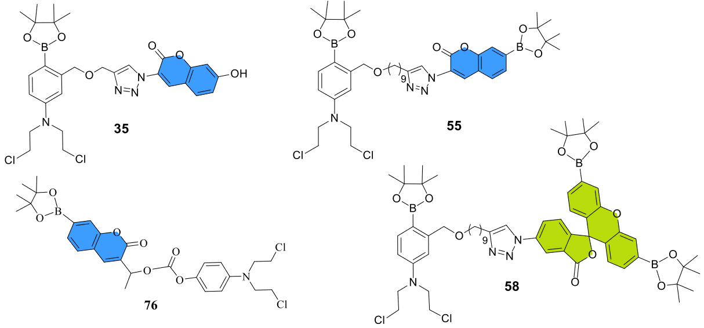

 

**About**  

 

Purpose: Organic Chemist seeking for a job in the field of chemistry.

 

 Summary: I have a PhD in Chemistry from the University of Wisconsin-Milwaukee under the supervision of Dr. Xiaohua Peng. I am looking for more work related to organic chemistry and synthesis. My research and work was related to the design, synthesis and investigation of novel boron-based theranostic small molecules intended to be used as both selective anticancer agents and profluorophores. 

 

 As anticancer agents, these theranostics comprise of the nitrogen mustard moiety that are known to target and alkylate the DNA thereby inhibiting DNA cellular processes, such as transcription and translation. As a result, the theranostics' nitrogen mustard may inhibit cancer cells' growth. Moreover, the nitrogen mustard functionality is directly conjugated to a phenyl boronic ester that deactivates the functionality of the mustard until H2O2-oxidative deboronation releases the active mustard to damage the cellular DNA. As profluorophores, the same theranostics also contain fluorescent scaffold to enable their detection in the biological context through safe photoimaging techniques.
 
 

 Because H2O2 is known to be overproduced in some cancer cells, the resulting strategy of boron-based theranostics selectively target cancer cells.

 

 <html>
<head>
    
</head>
<body>

    

</body>
</html>

 

 Besides my previous work, I am also open and willing to learn new chemistry and opportunities. Feel free to contact if you are interested in hiring me
 
 
