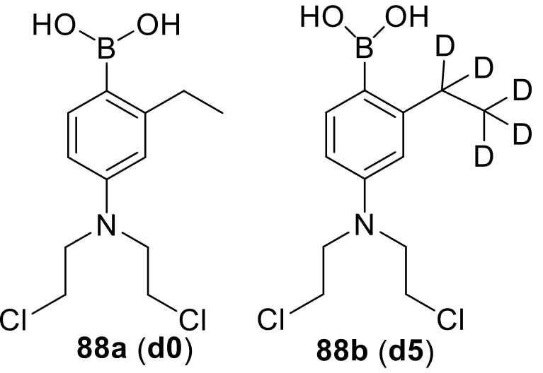

---
# Feel free to add content and custom Front Matter to this file.
# To modify the layout, see https://jekyllrb.com/docs/themes/#overriding-theme-defaults

layout: default
---

 
## About Me
 

Hello! I am an organic chemist with a PhD in Chemistry from the [University of Wisconsin-Milwaukee](https://uwm.edu/chemistry/our-people/saxon-eron/). I am currently seeking a job in the field of chemistry. Feel free to contact me if you're interested in my work.
 
 
## PhD Dissertation

> *Boron-based theranostics and prodrugs: design, synthesis, mechanism and biological investigation*

<html>
<head>
    
</head>
<body>

    

</body>
</html>

 
## Employment Experience
 
**1. Quality Control Lab Technician** (January 2018 – April 2019)  
    Company: MetalTek International         Location: Waukesha, WI
<ul>
     
<li>Operated analytical instruments, including LECO carbon/sulfur and nitrogen/oxygen instruments, x-ray, and arc optical emission spectrometers</li>
<li>Maintained and standardized instruments following Nadcap (National Aerospace and Defense Contractors Accreditation Program) approved protocols</li>
<li>Performed routine analysis of heterogeneous metals for determination of elemental composition</li>
</ul>
 
**2. Research and Teaching Assistant** (September 2019 – May 2024)  
University of Wisconsin–Milwaukee, Advisor: Prof. Peng Location: Milwaukee, WI 
<ul>
 
<li>Designed novel theranostic and prodrug nitrogen mustards as anticancer small
molecules</li>
<li>Isolated and purified compounds by column chromatography, distillation, precipitation, recrystallization, and trituration resulting in 4 novel theranostics</li>
<li>Characterized compounds by utilizing TLC, NMR, LCMS, HRMS Q-TOF, UV/VIS,
fluorescence, and fluorescence confocal microscope instruments</li>
<li>Evaluated theranostics and prodrugs using cytotoxicity and fluorescence colocalization assays in vitro with TNBC MDA-MB-468 cell line</li>
<li>Synthesized oligonucleotides by automated solid-phase synthesis with ABI 394,
purification and 32P radiolabeling of oligo for DNA interstrand cross-linking assays</li>
<li>Determined safety and anticancer efficacy of compounds in <i>in vivo</i> CD1 and xenograft athymic mice study following IACUC approved guidelines</li>
<li>Determined physiochemical properties of small molecules (solubility and permeability)</li>
<li>Determined photophysical properties of fluorescent dyes</li>
<li>Determined prodrug activation mechanism <i>in vitro</i> and <i>in vivo</i> through deuterium isotope-labeled mustard prodrugs </li>
</ul>

<html>
<head>
    
</head>
<body>

    

</body>
</html>

 
 
**3. Research Volunteer** (June 2024 – Current) 
University of Wisconsin–Milwaukee, Advisor: Prof. Peng Location: Milwaukee, WI 
<ul>
<li>Investigation of novel small molecule prodrugs and theranostics as selective anticancer and/or fluorogenic agents</li>
 
 
</ul>

## Skills
 
<ul>
<li>Synthetic organic chemistry, laboratory techniques and instrumentation</li> <li>Multi-step synthetic routes (>13 steps) of oxygen-,water-, light-sensitive reaction conditions</li> 
<li>Click CuAAC and boron chemistry</li> 
<li>Knowledge of the anticancer drug development process</li> 
<li>Microsoft Office, ChemDraw, ChemSketch, SciFinder, Reaxys, Shimadzu LabSolutions, Bruker TopSpin, ImageJ, Zeiss Zen, QuPath and GraphPad Prism</li> 
</ul>
 

## Auxiliary Skills
 
<ul>
<li>Lab safety and organization, self-motivated, detail-oriented, lab notebook literate</li> 
 
</ul>

## Publications
 
<ul>
<li>Fan, H.; Zaman, M. A. U.; Chen, W.; Ali, T.; Campbell, A.; Zhang, Q.; Setu, N. I.; <b>Saxon, E.</b>; Zahn, N. M.; Benko, A. M.; Arnold, L. A.; Peng, X., Assessment of Phenylboronic Acid Nitrogen Mustards as Potent and Selective Drug Candidates for Triple-Negative Breast Cancer. ACS Pharmacol. Transl. Sci. 2021, 4 (2), 687-702, <a href="https://pubs.acs.org/doi/10.1021/acsptsci.0c00092">doi.org/10.1021/acsptsci.0c00092</a></li>
<li><b>Saxon, E.</b>; Peng, X. (2021), Recent Advances in Hydrogen Peroxide Responsive Organoborons for Biological and Biomedical Applications. ChemBioChem. 2021, <a href="https://doi.org/10.1002/cbic.202100366">doi.org/10.1002/cbic.202100366</a></li> 
<li><b>Saxon, E.</b>; Ali, T.; Peng, X. (2024), Hydrogen Peroxide Responsive Theranostics for Cancer-Selective Activation of DNA Alkylators and Real-Time Fluorescence Monitoring in Living Cells. (under review, Eur. J. Med. Chem)</li>
</ul> 
 
 

## Presentations
 
<ul>
<li>Saxon E., Peng X., DNA Sequencing: Modern Techniques and Application (2020). UWM Graduate Seminar, Milwaukee WI.</li>
<li>Saxon E., Peng X., Synthesis of a Novel Phenyl Boronic Ester Nitrogen Mustard Analog (2021). Poster at the UWM Spring Symposium, Milwaukee WI.</li>
<li>Saxon, E., Peng, X. Biological Application of a Novel DNA-Alkylating Theranostic Agent (2022). Poster at the ACS Fall 2022 Conference, Chicago IL.</li>
<li>Saxon E., Peng X., Synthesis and Application of a Novel DNA Alkylating Theranostic Agent. (2022). Seminar at the UWM Milwaukee Institute for Drug Discovery Symposium, Milwaukee WI.</li>
</ul> 
 
 

## Awards 
 
<ul>
<li>UWM Chancellor’s Award (2019 – 2022)</li>
<li>UWM Graduate School Distinguished Dissertation Fellowship (DDF) Award (2023 – 2024)</li>
</ul>
 
 
## Patent 
<ul>
 
<li>Peng, X.; Saxon, E., Hydrogen Peroxide Responsive Theranostics. Patent Application 2024, US provisional patent No. 020871-0017-US01</li>
</ul> 
 
 