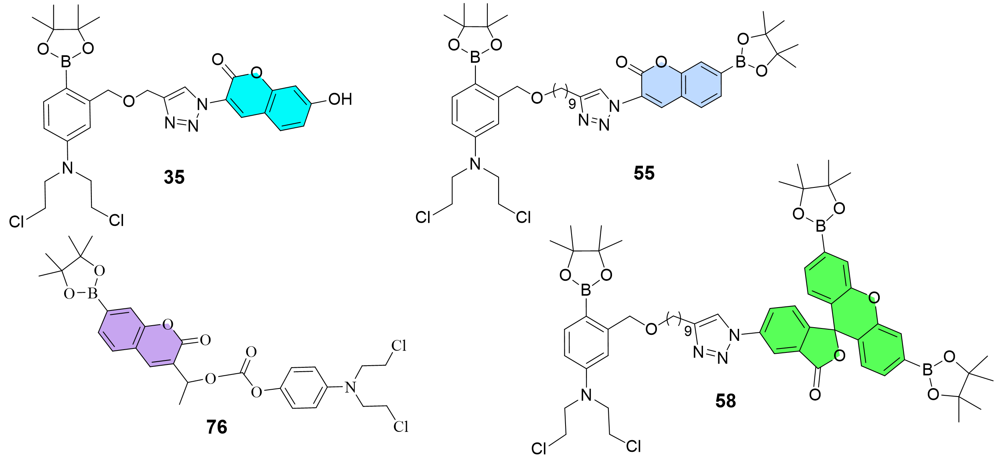

---
# Feel free to add content and custom Front Matter to this file.
# To modify the layout, see https://jekyllrb.com/docs/themes/#overriding-theme-defaults

layout: default
---

 
## About Me
 

Hello! I am an organic chemist and biochemist with a BSc and PhD in Chemistry from the [University of Wisconsin-Milwaukee](https://uwm.edu/chemistry/our-people/saxon-eron/). My research interests are in the synthesis and evaluation of novel DNA and protein targeting small organic molecules.
 
 
## PhD Dissertation

> <i>Boron-based theranostics and prodrugs: design, synthesis, mechanism and biological investigation</i> 
(2024, <a href="https://dc.uwm.edu/etd/3513/">UWM Digital Commons</a>)

<html>
<head>
    
</head>
<body>

    

</body>
</html>

 
### EMPLOYMENT EXPERIENCE

**1. R&D Scientist Level III** (October 2024 – Current)  
<a href="https://www.thermofisher.com/us/en/home/life-science/protein-biology/bulk-custom-protein-biology-products/bulk-manufacturing-capabilities.html">Thermo Fisher Scientific</a> (Rockford, IL)
<ul>

<li>Manage multiple concurrent projects as a Research and Development (R&D) organic synthetic chemist for the development of products related to protein cell analysis</li>
<li>Synthesis of novel green detergents (<b>91</b> and <b>92</b>), photoactivatable small molecules for stain-free detection of proteins in gel, and biotin-PEG for bioconjugation</li>
<li>Maintain lab notebook records of experimental procedures, data and observations</li>
<li>Utilize synthetic organic chemistry techniques, including kilogram multi-step synthesis, purification (column chromatography, extraction and recrystallization), and characterization (TLC, NMR, LC-MS, FTIR, QNMR, HPLC-PDA)</li>
<li>Analyze molecules for physical and functional properties, including stability, purity, melting point, Krafft point, CMC and western blot applications</li>
</ul>

<html>
<head>
    
</head>
<body>

    

</body>
</html>

 
 

**2. Postdoctoral Fellow** (July 2024 – October 2024)  
<a href="https://www.cuw.edu/academics/schools/pharmacy/index.html"> Concordia University Wisconsin</a>; Advisor: <a href="https://blog.cuw.edu/nih-grant-anxiety/">Prof. Cunningham </a>(Mequon, WI) 
<ul>

<li>Designed, synthesized and characterized novel sterol carrier protein-2 (SCP-2) inhibitors as endocannabinoid/cannabinoid system modulators for treatment of anxiety and stress</li>
<li>Hit-to-lead discovery, SAR synthesis and optimization of small organic molecules for targeting membrane-bound proteins</li>
<li>Maintained lab notebook records of experimental procedures, data, and observations</li>
<li>Utilized synthetic organic chemistry techniques, including multi-step synthesis, purification, and characterization (NMR, purity score, MS and melting point)</li>
<li>Routine upkeep of research equipment, including Varian 500 MHz NMR, Thermo Dionex 3000 HPLC-DAD, Sciex 4000 triple quad LC/MS and Biotage flash chromatography</li>
<li>Collaborated with an interdisciplinary team to interpret the results of structure-activity</li>

</ul>
 
<html>
<head>
    
</head>
<body>

    

</body>
</html>
 
 

**3. Research and Teaching Assistant** (September 2019 – May 2024)  
<a href="https://uwm.edu/chemistry/"> University of Wisconsin–Milwaukee</a>; Advisor: <a href="https://uwm.edu/chemistry/about/directory/peng-xiaohua/">Prof. Peng</a> (Milwaukee, WI) 

<html>
<head>
    
</head>
<body>

    

</body>
</html>

<ul>
 
<li>Designed novel theranostic and prodrug nitrogen mustards as anticancer molecules</li>
<li>Performed multi-step synthesis (>13 steps) of oxygen-, water-, light-sensitive reactions</li>
<li>Isolated and purified compounds by column chromatography, distillation, precipitation, recrystallization, and trituration resulting in 4 novel theranostics and 2 prodrugs</li>
<li>Characterized molecules utilizing TLC, NMR (Bruker), HPLC-MS (Shimadzu), HPLC (Thermo Dionex and Vanquish), HRMS Q-TOF (Shimadzu), UV/VIS, fluorescence (Perkin Elmer LS 55)</li>
<li>Evaluated theranostics and prodrugs using cytotoxicity and fluorescence colocalization assays <i>in vitro</i> with TNBC MDA-MB-468 cell line (confocal microscopes EVOS FL and Zeiss 710)</li>
<li>Synthesized oligonucleotides by automated solid-phase synthesis (ABI 394),
purification (MALDI-TOF and UV/VIS) and 32P radiolabeling of oligo and DNA-drug interaction study</li>

<html>
<head>
    
</head>
<body>

    

</body>
</html>
<li>Determined safety and anticancer efficacy of compounds in <i>in vivo</i> CD1 and xenograft athymic mice study following IACUC approved guidelines</li>
<li>Determined physiochemical properties of small molecules (solubility and permeability)</li>
<li>Determined photophysical properties of fluorescent dyes</li>
<li>Determined prodrug activation mechanism <i>in vitro</i> and <i>in vivo</i> through deuterium isotope-labeled mustard prodrugs (isotopologues)</li>

<html>
<head>
    
</head>
<body>

    

</body>
</html>

<li>Trained and supervised undergraduate students in research and teaching laboratories</li>
</ul>

 
 
**4. Quality Control Lab Technician** (January 2018 – April 2019)  
<a href="https://www.metaltek.com/"> MetalTek International</a> (Waukesha, WI)
<ul>

<li>Operated analytical instruments, including LECO carbon/sulfur and nitrogen/oxygen instruments, x-ray, and arc optical emission spectrometers</li>
<li>Maintained and standardized instruments following Nadcap (National Aerospace and Defense Contractors Accreditation Program) approved protocols</li>
<li>Performed routine analysis of heterogeneous metals for determination of elemental composition</li>
</ul>
 

 
### SKILLS

<ul>
<li>Synthetic organic chemistry, laboratory techniques and instrumentation</li>
<li>Click CuAAC, boron chemistry and heterocycle reactions</li> 
<li>Knowledge of the anticancer drug development process</li> 
<li>Microsoft Office, ChemDraw, ChemSketch, SciFinder, Reaxys, Shimadzu LabSolutions, Bruker TopSpin, ImageJ, Zeiss Zen, QuPath, GraphPad Prism, MestReNova, ELN LabGuru, Sigma CMC and VarioSkan LUX microplate reader</li> 
</ul>

 
### AUXILIARY SKILLS

<ul>
<li>Ability to maintain lab safety, lab cleanliness, lab notebook and meet deadlines</li> 
<li>Ability to rationally design and synthesize organic molecules </li> 
<li>Adherence to QMS and Regulatory Compliance Standards (ISO 9001 and GLP)</li> 
</ul>

 
### AWARDS

<ul>
<li>UWM Chancellor’s Award (2019 – 2022)</li>
<li>
UWM Graduate School Distinguished Dissertation Fellowship <a href="https://uwm.edu/chemistry/phd-candidate-eron-saxon-receives-the-2023-24-distinguished-dissertation-fellowship-ddf-award/">(DDF) Award</a> (2023 – 2024)</li>
</ul>

 
### PATENT

<ul>
<li>Peng, X.; Saxon, E., Hydrogen Peroxide Responsive Theranostics. Patent 2025, US provisional patent WO2025165931A1<a href="https://worldwide.espacenet.com/patent/search/family/096591396/publication/WO2025165931A1?q=pn%3DWO2025165931A1"> Espacenet Patent</a></li>
</ul> 

 
### PUBLICATIONS

<ul>
<li><b>Saxon, E.</b>; Stambekova D., Clark J.R., Peng, X. H2O2-Responsive Anticancer Prodrug: Synthesis, Precision Deuteration in Search of in vivo Metabolites, and Activation Pathway. <i>J. Med. Chem.</i> (2025) <a href="https://pubs.acs.org/doi/10.1021/acs.jmedchem.5c01975">doi.org/10.1021/acs.jmedchem.5c01975</a></li>
<li><b>Saxon, E.</b>; Ali, T.; Peng, X. (2024), Hydrogen Peroxide Responsive Theranostics for Cancer-Selective Activation of DNA Alkylators and Real-Time Fluorescence Monitoring in Living Cells. <i>Eur. J. Med. Chem.</i> 2024, <a href="https://www.sciencedirect.com/science/article/abs/pii/S0223523424005750?via%3Dihub">doi.org/10.1016/j.ejmech.2024.116695</a></li> 
<li><b>Saxon, E.</b>; Peng, X. (2021), Recent Advances in Hydrogen Peroxide Responsive Organoborons for Biological and Biomedical Applications. <i>ChemBioChem</i>. 2021, <a href="https://doi.org/10.1002/cbic.202100366">doi.org/10.1002/cbic.202100366</a></li> 
<li>Fan, H.; Zaman, M. A. U.; Chen, W.; Ali, T.; Campbell, A.; Zhang, Q.; Setu, N. I.; <b>Saxon, E.</b>; Zahn, N. M.; Benko, A. M.; Arnold, L. A.; Peng, X., Assessment of Phenylboronic Acid Nitrogen Mustards as Potent and Selective Drug Candidates for Triple-Negative Breast Cancer. <i>ACS Pharmacol. Transl. Sci.</i> 2021, 4 (2), 687-702, <a href="https://pubs.acs.org/doi/10.1021/acsptsci.0c00092">doi.org/10.1021/acsptsci.0c00092</a></li>
</ul> 

 
### PRESENTATIONS

<ul>
<li>Saxon E., Peng X., DNA Sequencing: Modern Techniques and Application (2020). UWM Graduate Seminar, Milwaukee WI.</li>
<li>Saxon E., Peng X., Synthesis of a Novel Phenyl Boronic Ester Nitrogen Mustard Analog (2021). Poster at the UWM Spring Symposium, Milwaukee WI.</li>
<li>Saxon, E., Peng, X. Biological Application of a Novel DNA-Alkylating Theranostic Agent (2022). Poster at the <a href="https://acs.digitellinc.com/b/sp/eron-saxon-323319">ACS Fall 2022 Conference</a>, Chicago IL.</li>
<li>Saxon E., Peng X., Synthesis and Application of a Novel DNA Alkylating Theranostic Agent. (2022). Seminar at the UW-Milwaukee Institute for Drug Discovery Symposium, Milwaukee WI.</li>
</ul> 
 
 